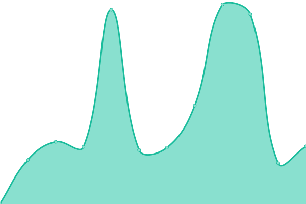

# [📈 Live Status](https://cymasuite.github.io): <!--live status--> **🟧 Partial outage**

This repository contains the open-source uptime monitor and status page for [Upptime](https://upptime.js.org), powered by [Upptime](https://github.com/upptime/upptime).

With [Upptime](https://upptime.js.org), you can get your own unlimited and free uptime monitor and status page, powered entirely by a GitHub repository. We use [Issues](https://github.com/upptime/upptime/issues) as incident reports, [Actions](https://github.com/upptime/upptime/actions) as uptime monitors, and [Pages](https://cymasuite.github.io) for the status page.

<!--start: status pages-->
<!-- This summary is generated by Upptime (https://github.com/upptime/upptime) -->
<!-- Do not edit this manually, your changes will be overwritten -->
<!-- prettier-ignore -->
| URL | Status | History | Response Time | Uptime |
| --- | ------ | ------- | ------------- | ------ |
|  [App Cymasuite](https://app.cymasuite.com/api/v1/healthcheck) | 🟩 Up | [app-cymasuite.yml](https://github.com/CymaSuite/upptime/commits/HEAD/history/app-cymasuite.yml) | 

 214ms
     
 | 

<a href="https://cymasuite.github.io/history/app-cymasuite">100.00%</a>
    

|  [Api Cymasuite](https://api.cymasuite.com) | 🟥 Down | [api-cymasuite.yml](https://github.com/CymaSuite/upptime/commits/HEAD/history/api-cymasuite.yml) | 

 490ms
     
 | 

<a href="https://cymasuite.github.io/history/api-cymasuite">0.00%</a>
    

|  [Web Cymasuite](https://web.cymasuite.com) | 🟩 Up | [web-cymasuite.yml](https://github.com/CymaSuite/upptime/commits/HEAD/history/web-cymasuite.yml) | 

 569ms
     
 | 

<a href="https://cymasuite.github.io/history/web-cymasuite">100.00%</a>
    

|  [Servicio de impuestos interno](https://homer.sii.cl/) | 🟩 Up | [servicio-de-impuestos-interno.yml](https://github.com/CymaSuite/upptime/commits/HEAD/history/servicio-de-impuestos-interno.yml) | 

 742ms
     
 | 

<a href="https://cymasuite.github.io/history/servicio-de-impuestos-interno">100.00%</a>
    

|  [Servicio de impuestos interno zeusr](https://zeusr.sii.cl) | 🟩 Up | [servicio-de-impuestos-interno-zeusr.yml](https://github.com/CymaSuite/upptime/commits/HEAD/history/servicio-de-impuestos-interno-zeusr.yml) | 

 877ms
     
 | 

<a href="https://cymasuite.github.io/history/servicio-de-impuestos-interno-zeusr">100.00%</a>
    

<!--end: status pages-->

[**Visit our status website →**](https://cymasuite.github.io)

## 📄 License

- Powered by: [Upptime](https://github.com/upptime/upptime)
- Code: [MIT](./LICENSE) © [Upptime](https://upptime.js.org)
- Data in the `./history` directory: [Open Database License](https://opendatacommons.org/licenses/odbl/1-0/)
