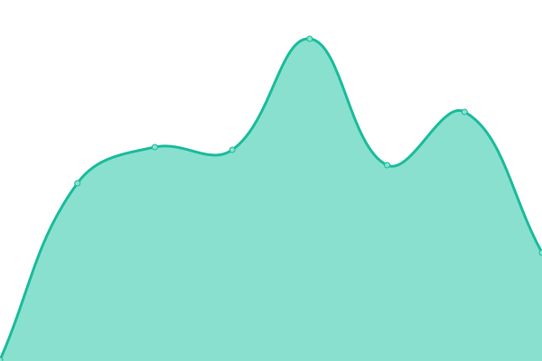
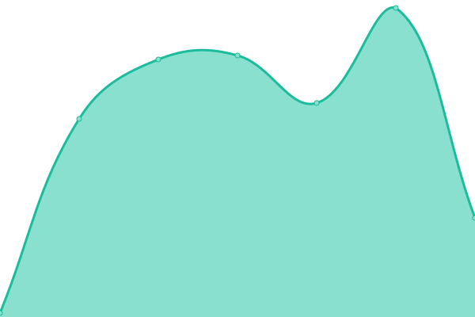
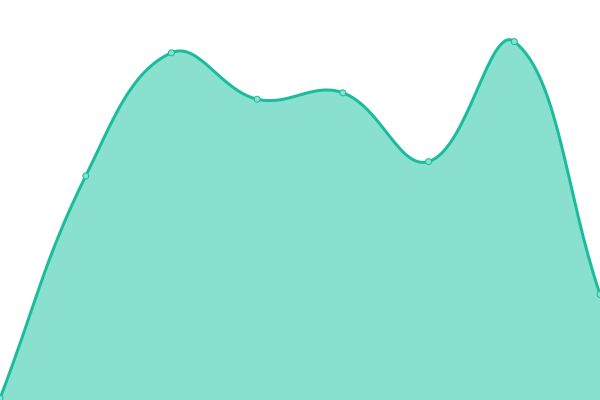
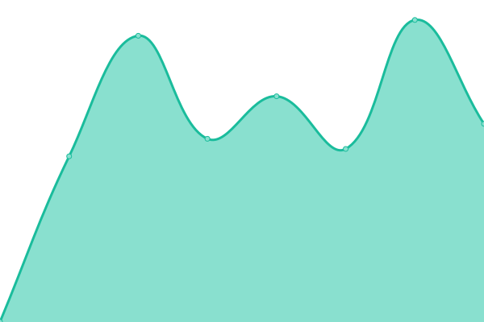

# [📈 Live Status](https://cymasuite.github.io): <!--live status--> **🟧 Partial outage**

This repository contains the open-source uptime monitor and status page for [Upptime](https://upptime.js.org), powered by [Upptime](https://github.com/upptime/upptime).

With [Upptime](https://upptime.js.org), you can get your own unlimited and free uptime monitor and status page, powered entirely by a GitHub repository. We use [Issues](https://github.com/upptime/upptime/issues) as incident reports, [Actions](https://github.com/CymaSuite/upptime/actions) as uptime monitors, and [Pages](https://cymasuite.github.io) for the status page.

<!--start: status pages-->
<!-- This summary is generated by Upptime (https://github.com/upptime/upptime) -->
<!-- Do not edit this manually, your changes will be overwritten -->
<!-- prettier-ignore -->
| URL | Status | History | Response Time | Uptime |
| --- | ------ | ------- | ------------- | ------ |
|  [Sitio Web Oficial Cymasuite](https://www.cymasuite.com) | 🟩 Up | [sitio-web-oficial-cymasuite.yml](https://github.com/CymaSuite/upptime/commits/HEAD/history/sitio-web-oficial-cymasuite.yml) | 

 1012ms
     
 | 

<a href="https://CymaSuite.github.io/upptime/history/sitio-web-oficial-cymasuite">100.00%</a>
    

|  [Sitio Web 2.0 Cymasuite](https://web.cymasuite.com) | 🟥 Down | [sitio-web-2-0-cymasuite.yml](https://github.com/CymaSuite/upptime/commits/HEAD/history/sitio-web-2-0-cymasuite.yml) | 

 0ms
     
 | 

<a href="https://CymaSuite.github.io/upptime/history/sitio-web-2-0-cymasuite">0.00%</a>
    

|  [Aplicación Web Cymasuite](https://app.cymasuite.com) | 🟩 Up | [aplicacion-web-cymasuite.yml](https://github.com/CymaSuite/upptime/commits/HEAD/history/aplicacion-web-cymasuite.yml) | 

 432ms
     
 | 

<a href="https://CymaSuite.github.io/upptime/history/aplicacion-web-cymasuite">99.28%</a>
    

|  [Api Cymasuite](https://api.cymasuite.com/api/v1/healthcheck) | 🟩 Up | [api-cymasuite.yml](https://github.com/CymaSuite/upptime/commits/HEAD/history/api-cymasuite.yml) | 

 179ms
     
 | 

<a href="https://CymaSuite.github.io/upptime/history/api-cymasuite">100.00%</a>
    

|  [Worker Cymasuite](https://api.cymasuite.com/sidekiq) | 🟥 Down | [worker-cymasuite.yml](https://github.com/CymaSuite/upptime/commits/HEAD/history/worker-cymasuite.yml) | 

 43ms
     
 | 

<a href="https://CymaSuite.github.io/upptime/history/worker-cymasuite">0.00%</a>
    

|  [Documentación Developer](https://api.cymasuite.com/api-docs/index.html) | 🟩 Up | [documentacion-developer.yml](https://github.com/CymaSuite/upptime/commits/HEAD/history/documentacion-developer.yml) | 

 122ms
     
 | 

<a href="https://CymaSuite.github.io/upptime/history/documentacion-developer">100.00%</a>
    

|  [Servicio de impuestos interno](https://homer.sii.cl) | 🟩 Up | [servicio-de-impuestos-interno.yml](https://github.com/CymaSuite/upptime/commits/HEAD/history/servicio-de-impuestos-interno.yml) | 

 1479ms
     
 | 

<a href="https://CymaSuite.github.io/upptime/history/servicio-de-impuestos-interno">100.00%</a>
    

|  [Zeus](https://zeusr.sii.cl) | 🟩 Up | [zeus.yml](https://github.com/CymaSuite/upptime/commits/HEAD/history/zeus.yml) | 

 1168ms
     
 | 

<a href="https://CymaSuite.github.io/upptime/history/zeus">100.00%</a>
    

|  [Mi indicador](https://mindicador.cl) | 🟩 Up | [mi-indicador.yml](https://github.com/CymaSuite/upptime/commits/HEAD/history/mi-indicador.yml) | 

 523ms
     
 | 

<a href="https://CymaSuite.github.io/upptime/history/mi-indicador">100.00%</a>
    

<!--end: status pages-->

[**Visit our status website →**](https://cymasuite.github.io)

## 📄 License

- Powered by: [Upptime](https://github.com/upptime/upptime)
- Code: [MIT](./LICENSE) © [Upptime](https://upptime.js.org)
- Data in the `./history` directory: [Open Database License](https://opendatacommons.org/licenses/odbl/1-0/)
